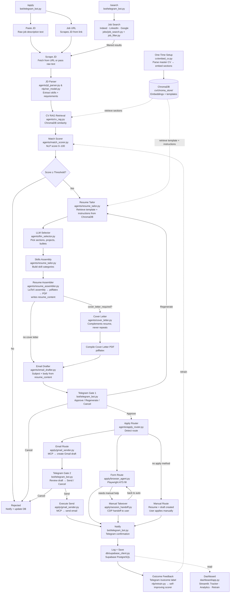

# CouchHire

<p align="center">
  
</p>

<p align="center">
  
  
  
  
  
</p>

> Job applications, automated. You stay on the couch.

CouchHire is a fully agentic job application pipeline. Paste a job description, approve via Telegram, and it handles the rest — tailored resume, cover letter, email draft, and ATS form filling. A self-improving NLP match scorer learns from your outcomes over time.

---

## Table of Contents

- [System Architecture](#system-architecture)
- [How It Works](#how-it-works)
- [Tech Stack](#tech-stack)
- [Project Structure](#project-structure)
- [Prerequisites](#prerequisites)
- [Getting Your API Keys](#getting-your-api-keys)
- [Installation](#installation)
- [Configuration](#configuration)
- [Database Setup](#database-setup)
- [CV Setup](#cv-setup)
- [Running the Project](#running-the-project)
- [Standalone Resume Generation](#standalone-resume-generation)
- [Docker](#docker)
- [Self-Improving Loop](#self-improving-loop)
- [Dashboard](#dashboard)
- [Contributing](#contributing)
- [License](#license)

---

## System Architecture

### Pipeline Flow



---

## How It Works

1. A job description comes in — pasted, scraped from a URL, or discovered via multi-board job search.
2. The **JD Parser** extracts structured requirements: skills, apply method, cover letter needed, and email instructions.
3. **CV RAG** retrieves the most relevant sections of your master CV from ChromaDB.
4. The **Match Scorer** produces a 0–100 fit score using NLP embeddings. Below the threshold → auto-rejected.
5. **Resume Tailor** generates a targeted LaTeX resume and compiles it to PDF. If a cover letter is required, the **Cover Letter** agent writes one that complements (never repeats) the resume.
6. The **Email Drafter** writes a human-quality application email referencing specific projects.
7. **Telegram Gate 1** — you review everything and approve, edit, or cancel.
8. The **Apply Router** detects the application method:
   - **Email** → Gmail draft via MCP → **Gate 2** → send
   - **Form** → Playwright browser agent fills the ATS form with LLM-assisted field mapping
   - **Manual** → draft created, you apply yourself
9. Everything is logged to Supabase. Label outcomes in Telegram and the scorer retrains on your data.

---

## Tech Stack

| Category | Technology |
|---|---|
| Orchestration | LangGraph |
| LLM Gateway | LiteLLM (9-model fallback across 5 providers) |
| Embeddings | ChromaDB + sentence-transformers |
| NLP | spaCy (NER) + custom match scorer |
| Database | Supabase (PostgreSQL) |
| Resume Compilation | pdflatex (texlive) |
| Email | Gmail via MCP (Streamable HTTP) |
| Form Filling | Playwright + LLM field mapping |
| Notifications | python-telegram-bot |
| Dashboard | Streamlit |
| Job Search | JobSpy (Indeed, LinkedIn, Google, Glassdoor, ZipRecruiter) |

---

## Project Structure

```
couchhire/
├── agents/                  # LangGraph agents
│   ├── jd_parser.py             # JD → structured requirements
│   ├── cv_rag.py                # ChromaDB retrieval → ranked CV sections
│   ├── match_scorer.py          # NLP match scoring (0–100)
│   ├── resume_tailor.py         # LaTeX resume tailoring + skills assembly
│   ├── cover_letter.py          # Cover letter generation
│   ├── email_drafter.py         # Application email generation
│   ├── apply_router.py          # Route detection (email | form | manual)
│   ├── llm_selector.py          # LLM-driven content selection
│   ├── resume_assembler.py      # LaTeX block extraction → PDF compilation
│   └── cv_content_helpers.py    # Section → named block extraction
├── apply/                   # Application execution
│   ├── gmail_sender.py          # MCP client for Gmail
│   ├── browser_agent.py         # ATS form filler (Playwright + LLM)
│   └── session_handoff.py       # CDP session manager
├── bot/
│   └── telegram_bot.py          # Notifications + approval gates
├── jobs/
│   ├── job_search.py            # Multi-board concurrent search
│   └── job_filter.py            # Score + filter results
├── cv/
│   ├── embed_cv.py              # Parse → embed pipeline
│   ├── cv_parser.py             # .tex/.pdf/.docx → sections
│   ├── uploads/                 # Your CV + optional template (gitignored)
│   ├── chroma_store/            # ChromaDB embeddings (gitignored)
│   ├── defaults/                # Fallback templates + instructions
│   └── output/                  # Generated PDFs + .tex (gitignored)
├── db/
│   ├── supabase_client.py       # CRUD helpers
│   ├── schema.sql               # Table definitions (idempotent)
│   └── create_tables.py         # One-time table creation script
├── nlp/
│   ├── ner_model.py             # Skill extraction
│   ├── retrain.py               # Fine-tune scorer on outcomes
│   └── models/                  # Trained model artifacts
├── llm/
│   └── client.py                # 9-model fallback chain
├── dashboard/
│   ├── app.py                   # Streamlit dashboard
│   └── helpers.py               # Dashboard utility functions
├── tests/                   # Test suite (290 tests)
│   ├── conftest.py              # Shared fixtures
│   └── test_*.py                # Unit + integration tests
├── pipeline.py              # LangGraph orchestrator (19 nodes, 7 conditional edges)
├── generate_resume.py       # Standalone resume generator
├── config.py                # Environment validation
├── entrypoint.sh            # Docker entrypoint script
├── Dockerfile
├── docker-compose.yml
├── .env.example             # Environment template
├── LICENSE
└── requirements.txt
```

---

## Prerequisites

- **Python 3.11+**
- **pdflatex** — `sudo apt install texlive-latex-full` (Linux) or install [MacTeX](https://tug.org/mactex/) (macOS)
- **Chromium** — installed automatically by Playwright
- At least one LLM provider API key (Groq is free and recommended to start)
- A Supabase project (free tier works)
- A Telegram bot (free, takes 2 minutes)

---

## Getting Your API Keys

### LLM Providers

You need at least one. CouchHire has a 9-model fallback chain — configure as many as you like for resilience.

| Provider | Free Tier | How to Get |
|---|---|---|
| **Groq** | Yes (generous) | [console.groq.com](https://console.groq.com) → API Keys → Create |
| **Gemini** | Yes | [aistudio.google.com](https://aistudio.google.com/apikey) → Create API Key |
| **Mistral** | Yes (phone verification) | [console.mistral.ai](https://console.mistral.ai) → API Keys → Create |
| **OpenRouter** | Yes | [openrouter.ai](https://openrouter.ai) → Keys → Create |
| **Anthropic** | Paid | [console.anthropic.com](https://console.anthropic.com) → API Keys → Create |
| **OpenAI** | Paid | [platform.openai.com/api-keys](https://platform.openai.com/api-keys) → Create |

### Supabase

1. Go to [supabase.com](https://supabase.com) and create a new project
2. Settings → API → copy **Project URL** → `SUPABASE_URL`
3. Copy **anon / public key** → `SUPABASE_KEY`

### Telegram Bot

1. Open Telegram → search for `@BotFather` → send `/newbot`
2. Follow the prompts → copy the token → `TELEGRAM_BOT_TOKEN`
3. Start your bot (send it `/start`), then visit `https://api.telegram.org/bot<YOUR_TOKEN>/getUpdates`
4. Find `"chat": {"id": ...}` in the response → `TELEGRAM_CHAT_ID`

### Gmail MCP Server

CouchHire uses [google_workspace_mcp](https://github.com/taylorwilsdon/google_workspace_mcp) as its Gmail server. CouchHire connects as an MCP client over Streamable HTTP.

**Google Cloud setup:**

1. Go to [Google Cloud Console](https://console.cloud.google.com) → create a project
2. Enable the **Gmail API** (APIs & Services → Library → Gmail API)
3. Configure **OAuth consent screen** → External → add scopes: `gmail.compose`, `gmail.modify` → add your email as a test user
4. Create **OAuth credentials** → Desktop application → copy Client ID and Client Secret

**Start the MCP server:**

1. Install [uv](https://astral.sh/uv):
   ```bash
   curl -LsSf https://astral.sh/uv/install.sh | sh
   ```

2. Create a launcher script (e.g. `~/start-gmail-mcp.sh`):
   ```bash
   #!/bin/bash
   export GOOGLE_OAUTH_CLIENT_ID="your-client-id.apps.googleusercontent.com"
   export GOOGLE_OAUTH_CLIENT_SECRET="your-client-secret"
   export OAUTHLIB_INSECURE_TRANSPORT=1
   export MCP_SINGLE_USER_MODE=true
   export USER_GOOGLE_EMAIL="your-email@gmail.com"

   uvx workspace-mcp --tools gmail --transport streamable-http
   ```

3. `chmod +x ~/start-gmail-mcp.sh` and run it — server starts at `http://localhost:8000/mcp`
4. On first run it opens your browser for Google OAuth — sign in and authorize
5. Set `GMAIL_MCP_URL=http://localhost:8000/mcp` in your `.env`

> The MCP server runs via `uvx` (system-level), separate from your project venv. Start it in a dedicated terminal before running the pipeline.

### Job Search ([JobSpy](https://github.com/speedyapply/JobSpy))

No API keys required. JobSpy scrapes job boards directly. Each board is scraped individually so a failure on one doesn't discard results from the others.

> ⚠️ LinkedIn is rate-limit aggressive (~10 pages per IP). Use proxies for heavy LinkedIn scraping.

---

## Installation

```bash
# Clone
git clone https://github.com/RaySatish/CouchHire.git
cd couchhire

# Create virtual environment
python -m venv venv
source venv/bin/activate  # Windows: venv\Scripts\activate

# Install dependencies
pip install -r requirements.txt

# Install Playwright browsers
playwright install chromium

# Install spaCy model
python -m spacy download en_core_web_sm

# Set up environment
cp .env.example .env
# Edit .env with your API keys (see above)
```

---

## Configuration

All config lives in `.env` (see `.env.example` for the full list with comments). You never edit `config.py` directly.

**Required variables:**

| Variable | Description |
|---|---|
| `LLM_PROVIDER` | `groq` \| `gemini` \| `mistral` \| `openrouter` \| `anthropic` \| `openai` |
| Provider API key | The key for your chosen provider |
| `SUPABASE_URL` | Supabase project URL |
| `SUPABASE_KEY` | Supabase anon/public key |
| `TELEGRAM_BOT_TOKEN` | From @BotFather |
| `TELEGRAM_CHAT_ID` | Your personal chat ID |
| `GMAIL_MCP_URL` | Gmail MCP server URL (e.g. `http://localhost:8000/mcp`) |
| `APPLICANT_NAME` | Your full name |
| `APPLICANT_EMAIL` | Your email address |
| `GITHUB_URL` | Your GitHub profile URL |

**Optional variables:**

| Variable | Default | Description |
|---|---|---|
| `MATCH_THRESHOLD` | `60` | Minimum match score (0–100) to proceed |
| `OUTPUT_BASE_DIR` | `cv/output/` | Where generated PDFs are saved |
| `APPLICANT_PHONE` | — | For ATS form fields |
| `APPLICANT_LINKEDIN` | — | For ATS form fields |
| `BROWSER_HEADLESS` | `false` | Run browser agent headless |
| `CDP_PORT` | `9222` | Chrome DevTools Protocol port |
| `JOBSPY_SITES` | `indeed,linkedin,google` | Job boards to search |
| `JOBSPY_COUNTRY` | `USA` | Country for searches |
| `MIN_RETRAIN_LABELS` | `10` | Minimum labeled outcomes before retraining |
| `RETRAIN_EVERY` | `10` | Auto-retrain every N new labels (0 = manual only) |

---

## Database Setup

1. In your Supabase project → **SQL Editor** → **New query**
2. Paste the contents of `db/schema.sql` and click **Run**
3. Verify:
   ```bash
   python -c "from db.supabase_client import get_all_applications; print('OK')"
   ```

---

## CV Setup

CouchHire accepts your master CV in LaTeX, PDF, or Word format.

### 1. Place your files in `cv/uploads/`

| File | Required | Description |
|---|---|---|
| `master_cv.tex` / `.pdf` / `.docx` | Yes | Your full master CV |
| `resume_template.tex` | No | Your preferred LaTeX resume layout |
| `cover_letter_template.tex` | No | Your preferred cover letter layout |
| `instructions.md` | No | Tailoring preferences (e.g. "always keep to 1 page", "lead with projects for ML roles") |

If you don't provide a template or instructions, CouchHire uses sensible defaults.

### 2. Embed your CV

```bash
python cv/embed_cv.py
```

This parses your CV into sections, embeds each one with sentence-transformers, and stores everything in ChromaDB. Re-run whenever you update your CV.

### 3. Verify

```bash
python -c "
import chromadb
client = chromadb.PersistentClient(path='cv/chroma_store')
col = client.get_collection('master_cv')
print(f'Chunks embedded: {col.count()}')
"
```

---

## Running the Project

Run each in a separate terminal. All three need to be running for the full pipeline.

**Terminal 1 — Telegram bot:**
```bash
python bot/telegram_bot.py
```

**Terminal 2 — Dashboard:**
```bash
streamlit run dashboard/app.py
```

**Terminal 3 — Pipeline:**
```bash
# Paste a JD
python pipeline.py --jd "Full job description text here"

# Scrape from URL
python pipeline.py --url "https://jobs.example.com/job/12345"

# From a file
python pipeline.py --file path/to/jd.txt

# Search job boards
python pipeline.py --search --query "machine learning engineer" --location "London"
```

After running, check Telegram — you'll get a notification for each job that passes the match threshold.

---

## Standalone Resume Generation

Generate a tailored resume without the full pipeline (no Telegram, no email, no apply routing):

```bash
python generate_resume.py --jd "Full job description text here"
python generate_resume.py --file path/to/jd.txt
python generate_resume.py  # uses a built-in default JD for testing
```

---

## Docker

Docker handles Python, pdflatex, Playwright, and all dependencies for you.

```bash
# Fill in your .env (same as manual setup)
cp .env.example .env

# Start everything
docker compose up --build

# One-off pipeline run
docker compose run app python pipeline.py --jd "Job description here"

# Stop
docker compose down
```

This starts three containers:
- **app** — Telegram bot + pipeline
- **dashboard** — Streamlit on port 8501
- **gmail-mcp** — Gmail MCP server on port 8000

---

## Self-Improving Loop

CouchHire gets better at predicting which jobs are worth applying for the more you use it.

1. An application is sent and logged in Supabase
2. You hear back from the employer → open Telegram → tap the outcome label
3. Labels: **No Reply** · **Screening** · **Interview** · **Rejected** · **Offer**
4. Every N new labels (configurable), the match scorer fine-tunes on your personal `(JD, resume, outcome)` pairs
5. The fine-tuned model loads automatically on the next pipeline run

The more you label, the more personalised the scoring becomes.

---

## Dashboard

Available at [localhost:8501](http://localhost:8501) once running.

| Tab | Description |
|---|---|
| **Tracker** | All applications, sortable by date / score / status |
| **Analytics** | Response rates, match score distribution, resume performance |
| **Retrain** | Outcome labels, manual retrain button, model accuracy |
| **Settings** | LLM provider, match threshold, ChromaDB status, connection tests |

---

## Contributing

1. Fork the repository
2. Create a feature branch: `git checkout -b feature/your-feature-name`
3. Make your changes
4. Test: `python pipeline.py --jd "test"` should run without errors
5. Open a pull request

For bugs, open an issue with the error message, your OS, Python version, and LLM provider.

**Never commit `.env`, `cv/uploads/`, or `cv/chroma_store/`.**

---

## License

MIT
